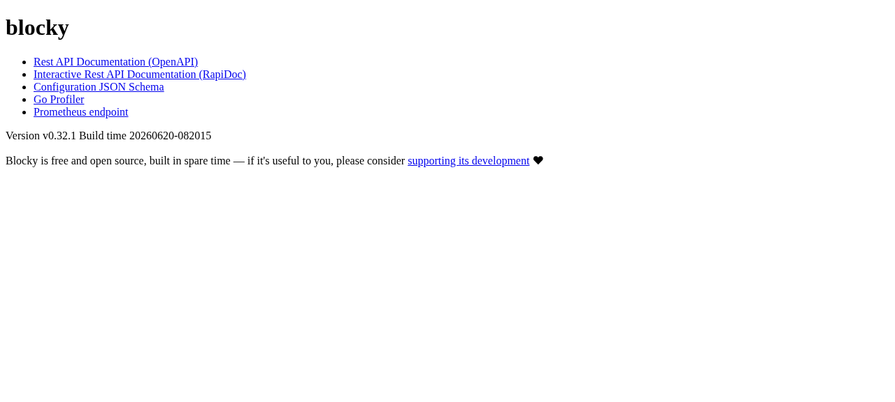
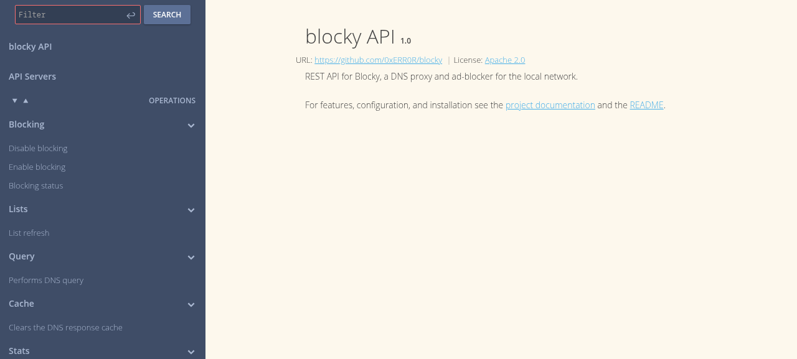
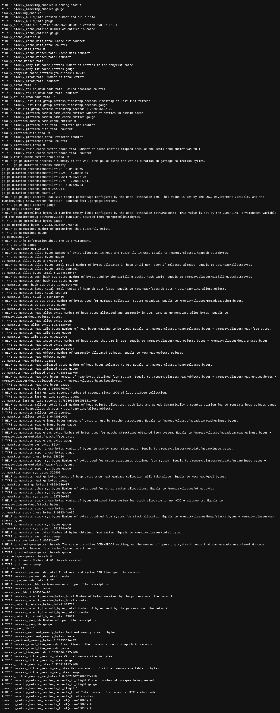

# Blocky — Railway Deployment Template

> **Fast and lightweight DNS proxy as ad-blocker for local network.** Blocky blocks ads, trackers, and malicious domains at the DNS level — no browser extensions required, works network-wide.

[](https://railway.app/template/blocky)

[](https://github.com/INAPP-Mobile/railway-blocky)
[](https://github.com/0xERR0R/blocky)
[](https://github.com/0xERR0R/blocky/blob/main/LICENSE)

---

# Deploy and Host

Deploy Blocky on Railway in one click. This template provisions a single container running Blocky v0.32.1 with a pre-configured ad-blocking setup — no database, no external services, zero additional dependencies.

## About Hosting

This template runs Blocky inside a single Railway container with:

- **DNS Proxy** — Listens on port 53 (UDP/TCP) for DNS queries from your network
- **Ad-Blocking** — Uses Steven Black's unified hosts file to block ads, trackers, and malware domains
- **REST API** — Management API on port 4000 for querying stats and configuration
- **Prometheus Metrics** — `/metrics` endpoint on port 4000 for monitoring with Grafana
- **DNS-over-HTTPS (DoH)** — Encrypted DNS queries on the HTTP listener
- **Caching** — Built-in DNS response cache with prefetching for fast resolution
- **Rate Limiting** — Per-client rate limiting to prevent abuse (configurable)

No database, no external dependencies — Blocky is a single ~20 MB Go binary.

## Why Deploy

Blocky is a modern, feature-rich DNS ad-blocker with 6.7K GitHub stars. Self-hosting gives you:

- **Network-wide ad blocking** — Every device on your network is protected, including IoT devices, smart TVs, and game consoles that can't run browser extensions
- **Privacy** — Your DNS queries never leave your control. Choose your upstream resolvers (Cloudflare, Quad9, or any DoH/DoT provider)
- **Performance** — Caching with prefetching means faster DNS resolution than your ISP's DNS
- **Modern protocols** — Full support for DNS-over-HTTPS, DNS-over-TLS, DNS-over-QUIC, and DNSSEC validation
- **Monitoring** — Built-in Prometheus metrics for Grafana dashboards
- **Zero maintenance** — Automatic list refresh, no database to manage, no memory leaks

## Common Use Cases

- **Home Network Privacy** — Protect every device in your home from tracking and ads
- **Family DNS Filtering** — Block adult content and malicious domains for family safety
- **Small Office / VPN** — Deploy as your Pi-Hole alternative with modern DNS protocol support
- **IoT Security** — Block IoT device callbacks to tracking and C2 servers
- **Developer DNS** — Test and debug DNS resolution with the REST API and query logging
- **DNS-over-HTTPS Gateway** — Provide encrypted DNS to your local network

## Dependencies for

### Runtime

| Dependency    | Version/Type | Purpose                                 |
|---------------|--------------|-----------------------------------------|
| Go Binary     | v0.32.1      | Single static binary (~20 MB)           |
| Alpine Linux  | 3.19         | Minimal runtime base image              |

### Deployment Dependencies

| Tool              | Purpose                                         |
|-------------------|-------------------------------------------------|
| Docker            | Container runtime (managed by Railway)          |
| Railway           | Hosting platform                                |

---

## Features

- **Network-wide Ad Blocking** — Blocks ads, trackers, and malware at DNS level with zero client configuration
- **Modern DNS Protocols** — DoH, DoT, DoQ, DNSSEC validation, DNS64 synthesis
- **REST API** — Query stats, manage configuration, and health monitoring
- **Prometheus Metrics** — Built-in `/metrics` endpoint for Grafana dashboards
- **DNS Caching** — Intelligent caching with prefetching for optimal performance
- **Per-Client Rate Limiting** — Token-bucket rate limiter to prevent abuse
- **Custom DNS Mapping** — Define local domain names for your network devices
- **Conditional Forwarding** — Route specific domains to different DNS resolvers
- **Blocking Schedules** — Apply different blocking policies based on time of day
- **Multiple Upstream Strategies** — Parallel best, random, or strict ordering
- **EDNS Client Subnet** — Support for geo-aware DNS resolution
- **Extended DNS Errors** — Detailed error codes per RFC 8914

---

## Quick Start

### One-click Deploy

[](https://railway.app/template/blocky)

### Configure Your Devices

After deployment, point your devices to use Blocky as their DNS server:

1. Get your Railway deployment URL (e.g., `your-app.up.railway.app`)
2. Configure DNS on each device:
   - **Router** — Set DNS server to your Railway URL (port 5353) for network-wide protection
   - **Single device** — Change network settings to use Blocky as DNS
3. Blocky starts blocking ads and trackers immediately with the default deny list

### Verify It's Working

```bash
# Test DNS resolution
dig @your-app.up.railway.app -p 5353 google.com

# Test ad blocking (should return 0.0.0.0)
dig @your-app.up.railway.app -p 5353 doubleclick.net

# Health check
dig @your-app.up.railway.app -p 5353 healthcheck.blocky
```

---

## Environment Variables

| Variable          | Required | Description                                                       |
|--------------------|----------|-------------------------------------------------------------------|
| `PORT`             | ⬜ No    | HTTP port for REST API and Prometheus metrics (Railway auto-sets) |
| `BLOCKY_CONFIG`    | ⬜ No    | Base64-encoded YAML config (overrides default entirely)           |
| `LOG_LEVEL`        | ⬜ No    | Log verbosity: trace, debug, info, warn, error (default: info)    |

### Advanced: Custom Config via BLOCKY_CONFIG

For full control, encode your complete `config.yml` and set it as a secret:

```bash
# 1. Create your config.yml
# 2. Base64-encode it
cat config.yml | base64 -w0

# 3. Set as Railway secret
railway variable set BLOCKY_CONFIG=<base64-output>
```

---

## Architecture

```
┌─────────────────────────────────────────────────┐
│                 Blocky Container                  │
│                                                  │
│  ┌─────────────┐  ┌──────────────────────────┐   │
│  │  DNS Proxy   │  │   HTTP Server (:4000)    │   │
│  │  (:53 UDP/TCP)│  │                         │   │
│  │             │  │  ├── REST API (/api/...)  │   │
│  │  ┌─────────┐│  │  ├── Prometheus (/metrics)│   │
│  │  │  Cache  ││  │  └── DoH (/dns-query)     │   │
│  │  └─────────┘│  └──────────────────────────┘   │
│  └──────┬──────┘                                  │
│         │                                         │
│  ┌──────▼──────┐                                  │
│  │  Upstream    │                                  │
│  │  Resolvers   │                                  │
│  │  (DoH/DoT)   │                                  │
│  └─────────────┘                                  │
└─────────────────────────────────────────────────┘
```

### Port Mapping

| Port | Service          | Description                     |
|------|------------------|---------------------------------|
| 5353 | DNS (UDP + TCP)  | Primary DNS proxy               |
| 4000 | HTTP             | REST API, Prometheus, DoH       |

---

## Security

- **Pinned version** — Built from `v0.32.1` release (not `:latest`)
- **No hardcoded secrets** — all configuration via env vars or config file
- **Non-root user** — Container runs as user 100
- **CA certificates** — Trusted certificates for HTTPS upstreams and list downloads
- **Apache-2.0 license** — Fully open source and permissive
- **DNSSEC optional** — Enable cryptographic DNS validation if desired
- **Rate limiting** — Per-client token bucket prevents amplification attacks

---

## Troubleshooting

| Problem                            | Likely Cause                    | Solution                                      |
|------------------------------------|---------------------------------|-----------------------------------------------|
| `dig` returns `connection refused` | Port 5353 not exposed             | Add port 5353 in Railway service settings     |
| Ads not blocked                    | Lists still downloading (first) | Wait 30-60s; check logs                       |
| DNS resolution slow                | Cold cache                      | Normal for first queries; improves with cache |
| `blocky healthcheck` fails         | Startup in progress             | Wait; check logs for upstream connectivity    |
| Rate limiting errors               | Too many queries from device    | Adjust `rateLimit` config or check for loops  |

---

## Screenshots

| Dashboard | API Documentation | Prometheus Metrics |
|-----------|------------------|-------------------|
|  |  |  |

---

## License

This template is distributed under the **MIT License**. Blocky itself is Apache-2.0 licensed.

## Resources

- [Blocky Documentation](https://0xerr0r.github.io/blocky)
- [Blocky GitHub](https://github.com/0xERR0R/blocky)
- [Railway Documentation](https://docs.railway.app)
- [INAPP-Mobile Templates](https://github.com/INAPP-Mobile)
